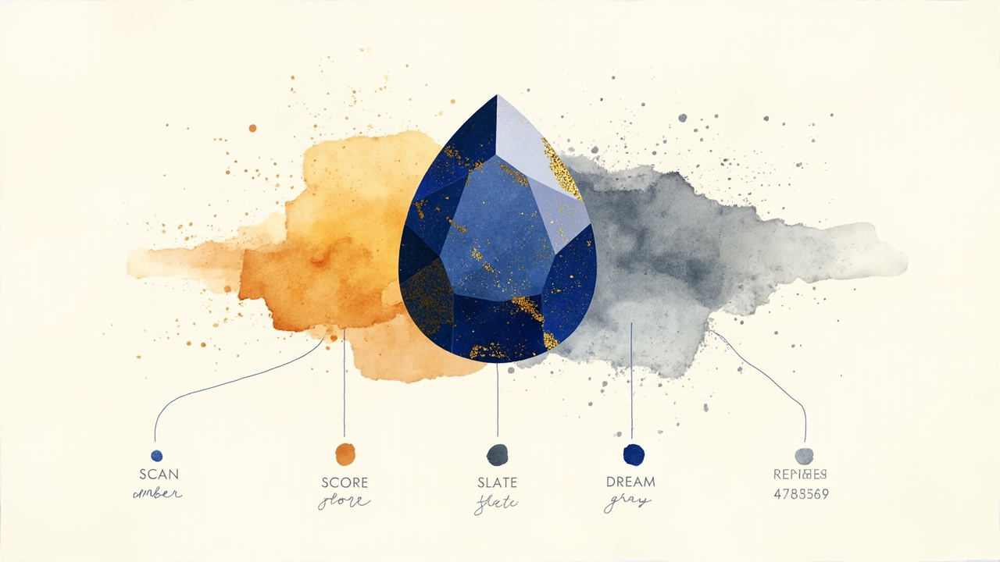
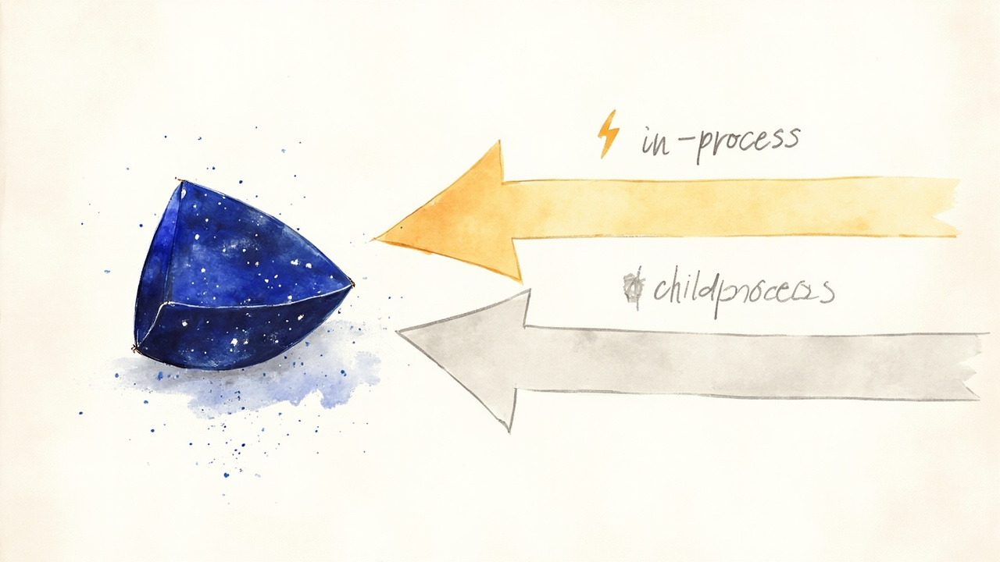

# LaPis — Local AI Memory for Coding Agents

**LaPis is a local, persistent AI memory layer for coding agents.** It gives [Pi Coding Agent](https://github.com/earendil-works/pi-coding-agent), [Claude Code](https://code.claude.com/docs/en/overview), [Hermes Agent](https://hermes-agent.nousresearch.com/), and MCP-compatible clients long-term project memory backed by SQLite.

LaPis remembers architectural decisions, bug fixes, project constraints, patterns, code context, documentation, discoveries, and previous work across sessions.

**Local-first:** project memory lives in one SQLite database by default, with no required hosted memory service and no API keys.


## Walkthrough

A 30-second tour of the LaPis memory lifecycle. The GIF below autoplays inline (silent); click it to watch on YouTube with the voiceover.

[](https://www.youtube.com/watch?v=dm5XT0b0jM4)

Source composition lives at [`repo-media/html-video/lapis-slideshow/index.html`](repo-media/html-video/lapis-slideshow/index.html) — edit the prompts and re-render with [`npx hyperframes render`](https://hyperframes.heygen.com/).

## Quick Start

Install LaPis for Pi Coding Agent:

```bash
pi install git:github.com/GeneGulanesJr/LaPis
```

Restart Pi and memory auto-wires on session start. Use `pi update --extensions` to keep it up to date.

LaPis does not install npm dependencies at runtime. If you are running from a local clone or developing the extension, install dependencies explicitly:

```bash
npm install
```

### Requirements

- Node.js 20+
- `better-sqlite3` for local SQLite access
- No Python dependency
- No API keys or cloud services

## Supported Integrations

### Pi Coding Agent Persistent Memory

The native Pi extension provides automatic session recall, memory capture, code and documentation retrieval, and lifecycle integration. Install it with the [Quick Start](#quick-start) command above.

### Claude Code Persistent Memory

LaPis integrates with the [Claude Code CLI](https://code.claude.com/docs/en/overview) — the same persistent memory, code guardrails, and session lifecycle as the Pi extension, wired through Claude Code's MCP + hooks config.

```bash
npx -y @genegulanesjr/lapis claude-code install
npx -y @genegulanesjr/lapis claude-code doctor   # verify install
```

This writes `.mcp.json` (MCP tools) and `.claude/settings.json` (lifecycle hooks). On first use, approve the LaPis MCP server via `/mcp` in an interactive `claude` session.

Full setup, hook mapping, troubleshooting, and install flags: [`docs/CLAUDE_CODE.md`](docs/CLAUDE_CODE.md).

### Hermes Agent Persistent Memory

LaPis integrates with [Hermes Agent](https://hermes-agent.nousresearch.com/) — the same persistent memory, code guardrails, and trust tracking as the Pi extension, wired through Hermes' MCP client and shell-hook system.

```bash
npx -y @genegulanesjr/lapis hermes install
npx -y @genegulanesjr/lapis hermes doctor    # verify install
```

This writes `mcp_servers.lapis` + `hooks:` into `$HERMES_HOME/config.yaml`, first-use consent, and a Hermes skill. Restart Hermes (or `/reload-mcp`) to load the MCP tools; hooks load at process start.

Full setup, hook mapping, troubleshooting, and install flags: [`docs/HERMES.md`](docs/HERMES.md).

### MCP Server

For MCP-compatible clients that need LaPis tools without hooks:

```bash
npx -y @genegulanesjr/lapis mcp
```

See [`docs/MCP.md`](docs/MCP.md).

## Why LaPis?

Coding agents can lose useful project knowledge between sessions or depend on manually maintained context files. LaPis provides structured, persistent memory that can automatically preserve and retrieve useful project knowledge instead. Its local-first, SQLite-backed store can retain:

- architectural decisions and their rationale
- previous bugs and fixes
- project conventions and constraints
- discoveries from earlier sessions
- relevant code and documentation context
- stale or superseded information that should no longer be trusted

## AI Memory for Coding Agents

- **Persists memory across sessions** - decisions, bug fixes, patterns, discoveries, constraints, and previous work remain available.
- **Automatically recalls context** - new sessions start with relevant memories loaded.
- **Keeps AI memory local-first** - SQLite is the default store; no hosted memory service or API key is required.
- **Indexes code** - web-tree-sitter parses JS/TS/TSX/Go/Python/Rust/SQL for semantic code lookup and analysis.

  

- **Indexes docs** - Markdown sections, links, glossary terms, and code examples become searchable.
- **Tracks trust** - memories linked to changed code lose confidence; stable linked code recovers trust.
- **Deduplicates memory** - similar saves are merged or flagged before they clutter recall.
- **Manages workspaces** - project isolation is explicit through create/list/archive workflows.
- **Cleans stale memory** - the Dream Cycle removes superseded, never-useful, and replaced memories based on quality signals.

  

- **Exposes an HTTP API** - optional REST server for programmatic access to missions, milestones, working units, todo/ledger domain, and code analysis.

  

- **Pre-coding intelligence** - preflight checks combine memory, code, and docs into before-coding context.
- **Compresses CLI output** - token-saving output compression reduces context window usage automatically.
- **Memory dashboard** - observability command for memory health, statistics, and index quality.

## Architecture

LaPis is a modular monolith: one installable Pi extension with clear internal ownership between Pi adapters, CLI routing, feature services, and shared platform/storage code. The same backend also serves an MCP stdio server (`lapis mcp`) and a Claude Code hooks bridge (`lapis claude-code install`). The Pi extension calls the backend through in-process `dispatch()` when possible, with child-process fallback for streaming operations such as indexing.

All three architecture views are interactive HTML — clickable nodes, themeable (light/dark), and animated request paths with marching dashes on highlighted edges.

### Architecture Overview

The full stack from Pi prompt to SQLite row. Chips animate 3 representative request lifecycles.

👉 **[Open the architecture overview](docs/diagrams/lapis-architecture.html)** — Save memory · Recall at start · Index code/docs

### Module Boundaries

The dependency view. Highlights the layered architecture, peer relationships between feature services, and the trust-sync bridge (the only explicit memory↔code link).

👉 **[Open the module boundaries diagram](docs/diagrams/lapis-module-boundaries.html)** — Request flow · Feature peers · Trust bridge

### Memory Lifecycle

How data moves through the four primary operations into one local SQLite store. The trust path is highlighted in violet to mark it as the only memory↔code bridge.

👉 **[Open the memory lifecycle diagram](docs/diagrams/lapis-memory-lifecycle.html)** — Write · Read · Index · Trust

For dependency rules and module ownership details, see [`docs/ARCHITECTURE.md`](docs/ARCHITECTURE.md) and [`docs/MODULE_MAP.md`](docs/MODULE_MAP.md).

## Benchmarks

### Token Efficiency

The compact wire format (`src/platform/protocol/compact-format.js`) uses compact encoding to reduce the token footprint of analysis responses inside Pi's context window. The benchmark runs real CLI commands against indexed repos, passes output through `compactResponse()`, and compares byte sizes.

Run it with:

```bash
node bench/bench-tokens.js
```

Latest local run: May 24, 2026, with fresh reindexes for both repos. `call-hierarchy` and `blast-radius` were skipped because the benchmark could not select a representative symbol with callers.

#### Percentage Saved per Tool

| Tool         | LaPis / PiMemoryExtension | PCBuilder |
| :----------- | :-----------------------: | :-------: |
| importance   |            21%            |    24%    |
| hotspots     |            0%             |    0%     |
| dead-code    |            44%            |    50%    |
| coupling     |            37%            |    40%    |
| extraction   |            23%            |    22%    |
| import-graph |            18%            |    20%    |
| cycles       |            0%             |    0%     |
| **overall**  |          **40%**          |  **49%**  |

#### Total Savings

|                | LaPis / PiMemoryExtension |          PCBuilder          |
| :------------- | :-----------------------: | :-------------------------: |
| Repo size      | 292 files / 6,913 symbols | 171 files / 207,599 symbols |
| Raw JSON       |         692.6 KB          |           36.7 MB           |
| Compact format |         417.5 KB          |           18.5 MB           |
| Bytes saved    |         275.1 KB          |           18.1 MB           |
| Tokens saved   |      ~80,500 tokens       |      ~5,436,007 tokens      |

See [`bench/README.md`](bench/README.md) for benchmark usage and interpretation notes.

### AI Memory vs No Memory Benchmark

In LaPis's paired regression benchmark, enabling persistent memory reduced active tokens by 92.6% while maintaining 18/18 fact accuracy.

This is an internal regression and directional benchmark, not a comprehensive external evaluation. It measures the same task twice—once with LaPis disabled and once with LaPis active—and is designed to catch regressions in LaPis behavior. It should not be interpreted as a universal real-world performance claim: prompts, repositories, model behavior, provider cache state, and tool choices vary.

Run it with:

```bash
npm run bench:pi-paired
```

Latest run: 2026-05-24 (results are written locally under `bench/results/`, which is gitignored, so the path below is not present in a fresh clone) — `bench/results/pi-paired-2026-05-24T14-47-20-651Z/report.json`

| Metric        | Memory On | Without Memory | Savings |
| ------------- | --------- | -------------- | ------- |
| Facts correct | 18/18     | 18/18          | no loss |
| Active tokens | 3,192     | 42,954         | -92.6%  |
| Wall time     | ~86s      | ~233s          | -63.1%  |
| Tool calls    | 6         | 49             | -87.8%  |
| Failed tools  | 0         | 4              | -100%   |

#### Per-category Breakdown

| Category         | Facts (on) | Tokens (on) | Savings |
| ---------------- | ---------- | ----------- | ------- |
| prior-decision   | 3/3        | 128         | 99.0%   |
| bug-history      | 3/3        | 603         | 94.2%   |
| staleness        | 3/3        | 426         | 94.2%   |
| navigation       | 3/3        | 72          | 99.0%   |
| negative-control | 6/6        | 1,963       | 65.7%   |

#### What Each Category Tests

| Category         | What it tests                                                                                                                              |
| ---------------- | ------------------------------------------------------------------------------------------------------------------------------------------ |
| prior-decision   | Recalls an architectural decision and its rationale, then names the current module involved.                                               |
| bug-history      | Recalls why a fix exists, including the historical failure mode that is not obvious from the final code alone.                             |
| staleness        | Checks whether LaPis warns that an indexed code view may be stale and should be verified or reindexed before trust.                        |
| navigation       | Uses memory to jump to the likely hook/module and confirm where extension wiring lives.                                                    |
| negative-control | Asks current-source questions that should not need memory facts; memory-on should route cheaply to code lookup instead of adding overhead. |

Memory-on achieved perfect accuracy with 92.6% fewer active tokens overall. Memory-dependent tasks saved 94.2-99.0% active tokens in this run.

The paired benchmark also reports behavior counters. In the latest run, memory-on used 6 total tools, 4 code-oriented tools, 4 memory tools, 12 assistant turns, and 0 failed tools. These counters help distinguish real memory regressions from normal provider cache and latency variance. The negative-control tasks are current-source questions; they should avoid memory facts and route quickly through `memory-code search` plus targeted reads when code verification is needed.

## Website

The LaPis landing page is included in [`website/`](website/). It is a build-free static site configured for Cloudflare Workers Static Assets and Cloudflare Pages; see the [deployment instructions](website/README.md).

## Documentation

- [`docs/INDEX.md`](docs/INDEX.md) - documentation map and integration transports.
- [`CONTRIBUTING.md`](CONTRIBUTING.md) - contributor workflow and checks.
- [`docs/ARCHITECTURE.md`](docs/ARCHITECTURE.md) - architecture overview and dependency rules.
- [`docs/MODULE_MAP.md`](docs/MODULE_MAP.md) - module ownership and entry points.
- [`docs/ARCHITECTURE_MODULARIZATION.md`](docs/ARCHITECTURE_MODULARIZATION.md) - detailed modularization assessment.
- [`docs/COMMANDS.md`](docs/COMMANDS.md) - command reference.
- [`docs/API.md`](docs/API.md) - HTTP API and CLI reference.
- [`docs/CONFIGURATION.md`](docs/CONFIGURATION.md) - config file and stored data.
- [`docs/CLAUDE_CODE.md`](docs/CLAUDE_CODE.md) - Claude Code CLI integration (MCP + hooks).
- [`docs/HERMES.md`](docs/HERMES.md) - Hermes Agent integration (MCP + hooks + skill).
- [`docs/MCP.md`](docs/MCP.md) - standalone MCP server (tools only).
- [`docs/DREAM_CYCLE.md`](docs/DREAM_CYCLE.md) - stale-memory cleanup behavior.
- [`docs/TUTORIAL.md`](docs/TUTORIAL.md) - step-by-step usage guide.
- [`docs/GITHUB_ISSUE_BREAKDOWN.md`](docs/GITHUB_ISSUE_BREAKDOWN.md) - modularization issue breakdown.
- [`docs/code-indexing.md`](docs/code-indexing.md) - async code indexing.
- [`docs/SKILL.md`](docs/SKILL.md) - extension skill overview.

## FAQ

### What is LaPis?

LaPis is an open-source, local AI memory system for coding agents. It uses SQLite-backed persistent project memory to preserve useful knowledge across sessions.

### Does LaPis give Claude Code persistent memory?

Yes. LaPis connects its MCP tools to Claude Code and installs lifecycle hooks through `.mcp.json` and `.claude/settings.json`. The hooks provide the session lifecycle and guardrails described in the [Claude Code setup guide](docs/CLAUDE_CODE.md).

### Does LaPis work with Pi Coding Agent?

Yes. LaPis runs as a native Pi extension that automatically wires memory into session startup and uses the local backend for memory, code, and documentation tools.

### Does LaPis work with Hermes Agent?

Yes. LaPis configures its MCP server in the Hermes client, installs shell hooks and a Hermes skill, and provides persistent memory, code guardrails, and trust tracking. See the [Hermes setup guide](docs/HERMES.md).

### Where does LaPis store its memory?

By default, LaPis stores memory locally in the SQLite database at `~/.pi/memory/memory.db`.

### Is LaPis an MCP server?

LaPis exposes an MCP stdio server for compatible clients. It also provides deeper lifecycle integrations for Pi Coding Agent, Claude Code, and Hermes Agent through their respective extension or hook systems.

## License

ISC
